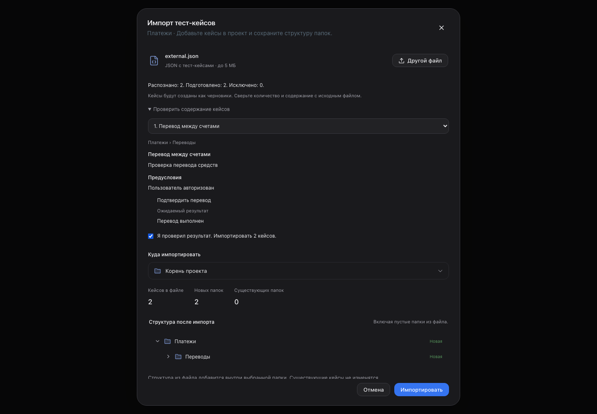
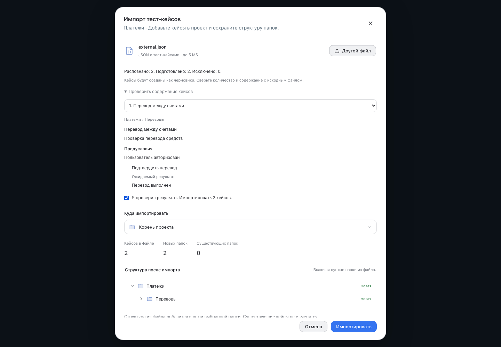

# Импорт внешнего JSON

Обновлено 10 сентября 2026 года.

В разделе тест-кейсов откройте импорт и выберите JSON с кейсами. Экспорт Falcon
v1/v2 работает как раньше. Для внешнего формата нажмите «Преобразовать с OpenRouter».
После обработки проверьте число распознанных кейсов, их содержание и дерево папок.
Укажите папку назначения, подтвердите проверку и нажмите «Импортировать».

Модель определяет поля и группы, а сервер переносит исходный текст. Новые кейсы
получают статус черновика. Неизвестные поля сохраняются в тестовых данных.
Если нет ожидаемого результата, исходная процедура остаётся в описании с замечанием.
Нераспознанные записи, обнаруженные при преобразовании, показаны отдельно.

Распознавание произвольной структуры не гарантирует правильность каждого кейса:
сверяйте количество и содержание с исходным файлом. Лимиты: 5 МБ, 2 000 распознанных
кейсов; очень крупный отдельный кейс может потребовать разделения файла.
При временном сбое можно продолжить обработку в открытом диалоге. После закрытия
или перезагрузки преобразование начинается заново. До подтверждения импорта кейсы
и папки в проекте не создаются. Текст для распознавания обрабатывается через OpenRouter.

Проверено в Chrome и WebKit, в светлой и тёмной теме и на ширине 390 px.

